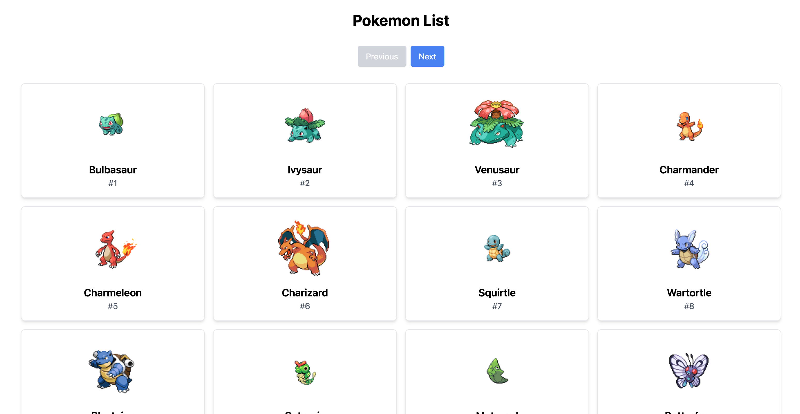

# How to run

Open 2 terminals. One for running the server and one for running the client

**Server:**
```
$ cd server
$ npm i
$ npm run dev
```
Server is now running at http://localhost:3000

**Client:**
```
$ cd client
$ npm i
$ npm run dev
```
Client is now running at http://localhost:5173


## Screenshot


